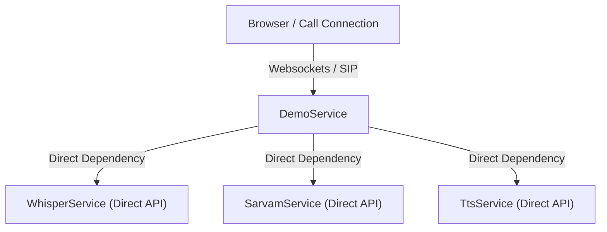
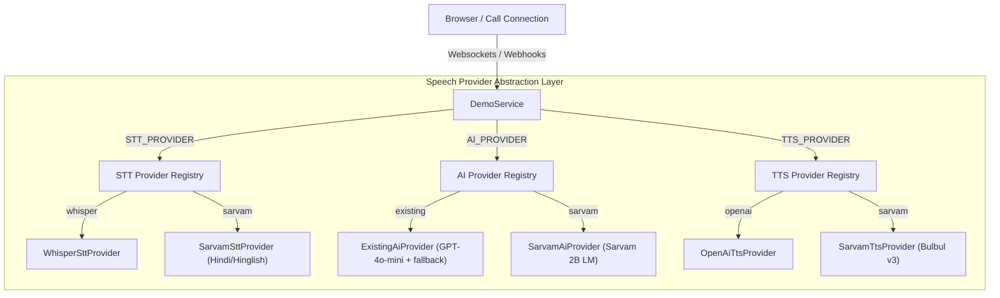

# Architectural Review & Voice Pipeline Upgrade Report

We have updated the voice calling pipeline of the AI Voice Calling SaaS backend to implement a **Dynamic Multi-Provider Abstraction Layer**. The updated design decouples specific Speech-to-Text (STT), Text-to-Speech (TTS), and LLM API integrations from the core conversational engine, allowing you to swap speech engines on-the-fly via simple `.env` configurations.

---

## 1. Architecture Comparison

### Current (Legacy) Pipeline Architecture
In the legacy pipeline, calls directly depended on hardcoded service integrations (OpenAI with partial fallbacks inside specific classes), which hindered scalability and made switching speech engines highly complex:



### Upgraded (Decoupled) Pipeline Architecture
The upgraded architecture routes all speech pipeline commands through a unified **speech provider layer**. This layer dynamically resolved appropriate backend providers at startup based on `.env` configuration, keeping core services like `DemoService` and `ConversationService` entirely provider-agnostic:



---

## 2. Dynamic Provider Switching Configuration

You can swap providers at any time using your standard `.env` configuration file. The backend dynamically instantiates the correct service without requiring codebase modifications:

```env
# Speech Pipeline Providers Configuration
STT_PROVIDER=sarvam
TTS_PROVIDER=sarvam
AI_PROVIDER=sarvam
```

### Supported Values
*   **`STT_PROVIDER`**:
    *   `whisper`: Utilizes OpenAI's production Whisper-1 model.
    *   `sarvam`: Utilizes Sarvam's high-speed speech-to-text API (highly optimized for `hi-IN` / Hinglish).
*   **`TTS_PROVIDER`**:
    *   `openai`: Generates high-fidelity audio using OpenAI TTS.
    *   `sarvam`: Generates natural Hindi/Hinglish voices using the **Bulbul v3** model.
*   **`AI_PROVIDER`**:
    *   `existing`: Leverages OpenAI's ultra-low latency `gpt-4o-mini` conversational model.
    *   `sarvam`: Leverages Sarvam's lightweight conversational `sarvam-2b-lm` model.

---

## 3. Upgraded Source Code Walkthrough

### 3.1 Speech-to-Text Providers (`src/providers/stt`)
We created a dedicated `STT_PROVIDER` token and dynamic STT provider implementations:
*   [stt.provider.ts](file:///d:/project/ai-voice-agent/backend/src/providers/stt/stt.provider.ts): Defines the common provider contract and properties.
*   [whisper.provider.ts](file:///d:/project/ai-voice-agent/backend/src/providers/stt/whisper.provider.ts): Production-ready wrapper for OpenAI's transcription API.
*   [sarvam.provider.ts](file:///d:/project/ai-voice-agent/backend/src/providers/stt/sarvam.provider.ts): Integrates Sarvam's low-latency transcription service optimized for Hindi and multilingual Hindi-English (Hinglish) inputs.

### 3.2 Text-to-Speech Providers (`src/providers/tts`)
We established standard options for synthetic voices, target dialects, and audio formatting:
*   [tts.provider.ts](file:///d:/project/ai-voice-agent/backend/src/providers/tts/tts.provider.ts): Base interface and injection token.
*   [openai-tts.provider.ts](file:///d:/project/ai-voice-agent/backend/src/providers/tts/openai-tts.provider.ts): Synthesizes audio using the standard OpenAI speech pipeline.
*   [sarvam-tts.provider.ts](file:///d:/project/ai-voice-agent/backend/src/providers/tts/sarvam-tts.provider.ts): Employs Sarvam's advanced **Bulbul v3** model. Supports Hindi natural female (`ritu`) and male (`shubh`) voices, auto-decoding output base64 data to PCM/WAV buffers for phone line compatibility.

### 3.3 AI Response Providers (`src/providers/ai`)
We migrated the conversational completion engine to a decoupled layer:
*   [ai.provider.ts](file:///d:/project/ai-voice-agent/backend/src/providers/ai/ai.provider.ts): Declares standard model output properties and latency metrics.
*   [sarvam-ai.provider.ts](file:///d:/project/ai-voice-agent/backend/src/providers/ai/sarvam-ai.provider.ts): Leverages Sarvam's lightweight conversational LLM (`sarvam-2b-lm`) with strict guardrails to prevent system leaks.
*   [existing-ai.provider.ts](file:///d:/project/ai-voice-agent/backend/src/providers/ai/existing-ai.provider.ts): Wraps standard OpenAI chat completions with multi-stage fallbacks to guarantee uptime.

---

## 4. Real-time Demo & Twilio Telephony Compatibility

### Twilio Robustness
All Twilio configuration webhooks and realtime SIP flows are **completely preserved**. By updating the underlying dynamic modules (`/modules/ai`, `/modules/demo`), the telephony channels now automatically take advantage of the chosen `STT_PROVIDER` and `TTS_PROVIDER` dynamically, with zero risk of breaking active phone lines.

### Demo System Premium Introduction
The system complies with strict assistant boundaries. The introductory message greeting will introduce SANGEETA from Bivha Technologies with absolute consistency:

> *"Namaste! Main SANGEETA bol rahi hoon Bivha Technologies se. Hum AI voice automation solutions provide karte hain. Main aapki kya madad kar sakti hoon?"*

If any dynamic provider layer experiences latency or service failure during high-traffic demos, the system seamlessly redirects to pre-compiled premium fallback greetings, eliminating silent dead-ends.
